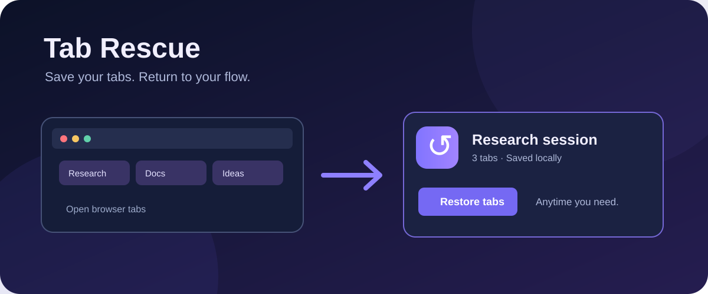

# Tab Rescue



**Save the tabs you need. Find them later. Restore them in one click.**

Tab Rescue is a local-first Chrome extension for saving browser windows as named sessions. It also makes automatic backups every 15 minutes when the set of open web tabs changes. There is no account, backend, or analytics.

> **Status:** Functional prototype. The automated core tests pass. Load the unpacked extension in Chrome and test save, restore, import, and export before relying on it for important work. Automatic snapshots are periodic, not a guarantee that every recently closed tab can be recovered.

## Features

- Save all regular HTTP(S) tabs in the current window as a named session.
- Restore a session in a **new** Chrome window without closing your current tabs.
- Search session names and URLs; filter pinned or automatic backups.
- Pin important sessions so retention pruning preserves them.
- Rename and delete sessions.
- Export sessions to JSON and import them later.
- Automatic snapshots every 15 minutes when the set of regular web URLs changes.
- Local storage only; no webpage content, cookies, or passwords are read.

## Install locally

1. Download or clone this repository.
2. In Chrome, open `chrome://extensions`.
3. Turn on **Developer mode**.
4. Click **Load unpacked** and select the **Tab-Rescue** folder (the one containing `manifest.json`).
5. Pin the extension to Chrome's toolbar if you want fast access.

Click the Tab Rescue icon, give the current window a name, and press **Save tabs**. To recover it, click **Restore**. Browser internal URLs (including `chrome://` pages), `file://` URLs, and incognito tabs are not saved by the automatic backup.

## How it works

```text
Current window ── Save ──────┐
                             ├── chrome.storage.local ── Search / Restore / Export
15-minute alarm ── Snapshot ─┘
```

The popup is the interface; the Manifest V3 service worker handles the periodic alarm. Shared functions in `src/core.js` validate URLs and imported data, cap snapshots at 300 tabs, and retain up to 100 sessions. Old unpinned sessions are pruned first. See [architecture](docs/architecture.md) and the [privacy explanation](PRIVACY.md).

## Project structure

```text
Tab-Rescue/
├── assets/               Toolbar icons (PNG)
├── docs/
│   ├── architecture.md   Data flow and boundaries
│   ├── banner.svg        README illustration
│   └── roadmap.md        Planned work
├── src/
│   ├── background.js     Automatic snapshots
│   ├── core.js           Validation and session logic
│   ├── popup.css         Interface styling
│   ├── popup.html        Popup structure
│   └── popup.js          Save, restore, search, import/export
├── tests/core.test.js    Node built-in test runner
├── manifest.json         Chrome MV3 permissions and entry points
├── PRIVACY.md
├── CONTRIBUTING.md
└── LICENSE
```

## Develop and test

Requires Node.js 20 or later for local checks; the extension itself has no npm dependencies and runs directly in Chrome.

```bash
npm test
npm run check
```

After changing files, click **Reload** on the extension card at `chrome://extensions`. Check the service worker console for backup errors. A useful manual pass is: save a window, rename it, pin it, restore it, export JSON, delete it, import the backup, and confirm its tabs reopen.

## Permissions and privacy

| Permission | Purpose |
| --- | --- |
| `tabs` | Read tab URLs/titles for snapshots and reopen them. |
| `storage` | Store snapshots on the device. |
| `alarms` | Schedule periodic backups. |

URLs and titles can contain sensitive information. Exported JSON is readable text: store it privately. Tab Rescue never uploads it. See [PRIVACY.md](PRIVACY.md) for details.

## Limits and next steps

Tab Rescue restores URLs, not scroll positions, form entries, logins, or browser tab group metadata. Backups can miss changes made just before a browser crash. Chrome may restrict tabs in special windows. The [roadmap](docs/roadmap.md) lists possible enhancements.

## License

MIT © 2026 Brian Xin. See [LICENSE](LICENSE).
